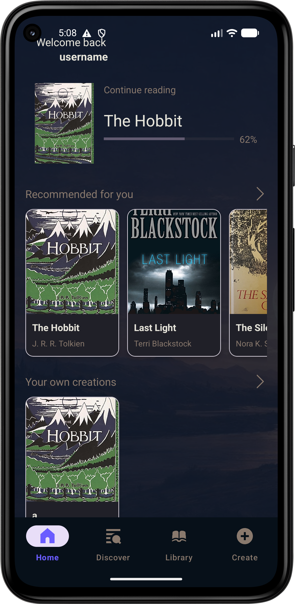
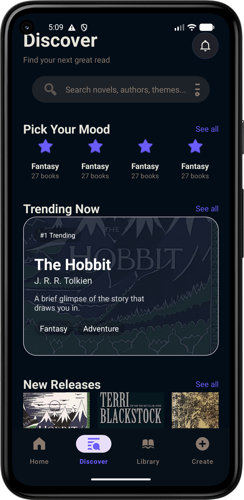
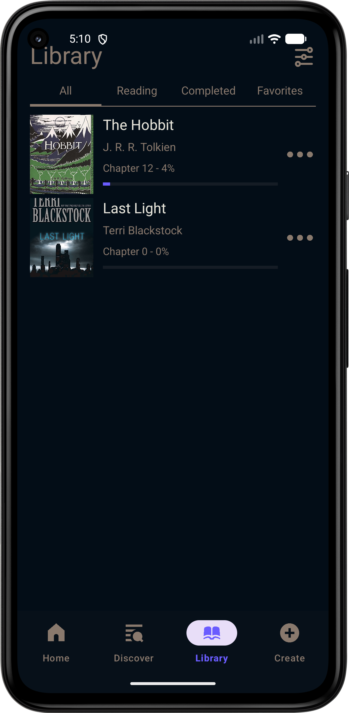
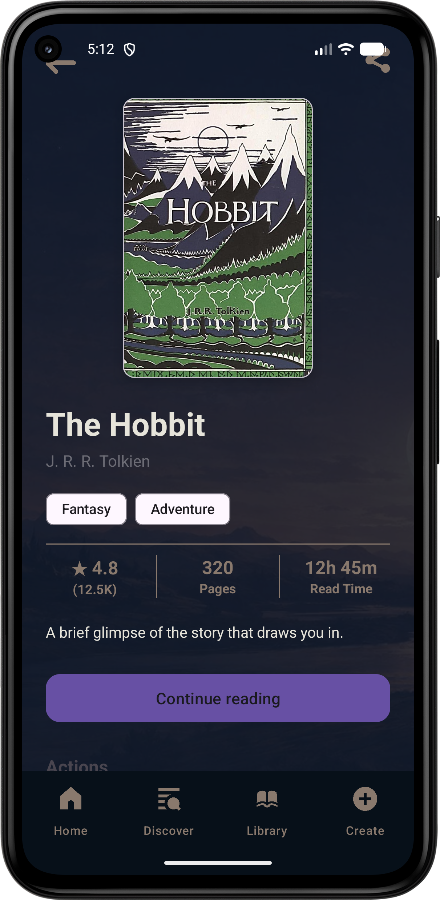
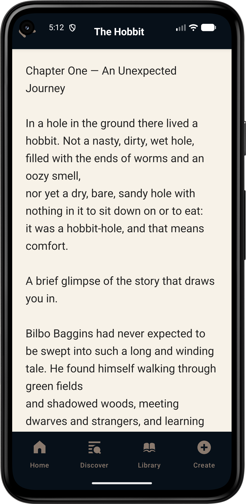
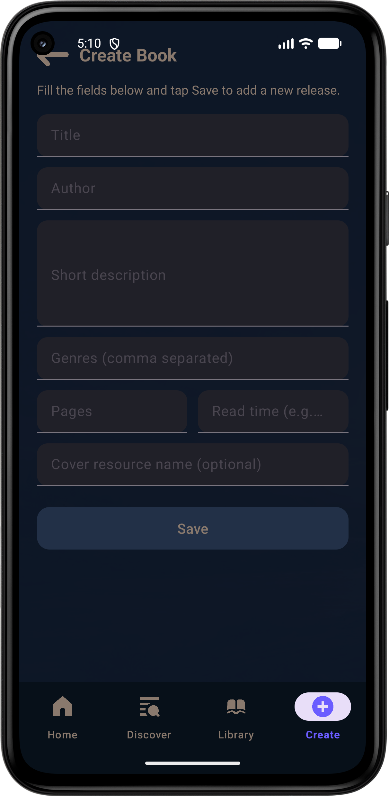

# **NovelRepo**


---
## Idea

NovelRepo is a simple reading and library‑management app. The goal is to give the user a personal space to store books, track reading progress, discover new titles, and create their own books that appear in the “Your own creations” section. The app is built to meet all requirements for full CRUD operations, a local database, and an additional feature.

### How it works:

The app uses MVVM architecture with a Room database. All books are stored locally and remain available after restart.

The user can:

-add books to their library

-remove books from the library

-update reading progress (chapter and percentage)

-open a book and read it in a dedicated Reader screen

-create their own books through the Create screen

-share a book using a Share Intent

-browse recommended books and new releases

### Architecture

The project uses:

-MVVM (ViewModel + LiveData)

-Repository layer for Room operations

-Room database (DAO + Entities)

-Activities for each main screen

-RecyclerView adapters for lists

-Material Design components

### Folder structure:
```
Code
/data
    AppDatabase.kt
    Book.kt
    BookDao.kt
/repository
    BookRepository.kt    
/util
    ResHelper.kt
/viewmodel
    BookViewModel.kt
/ui
    BookDetailsActivity.kt
    BookHorizontalAdapter.kt
    CreateBookActivity.kt
    DiscoverActivity.kt
    LibraryActivity.kt
    LibraryAdapter.kt
    MainActivity.kt
    ReaderActivity.kt
    RecommendedAdapter.kt
```
---
### **User Flow**

**The user starts on the main screen (MainActivity), where they see:**

the book they are currently reading

recommended books

their own created books

**Through the bottom navigation, they can move to:**

Discover – browse books

Library – view their saved books

Create – add a new book

**In Library, the user can:**

view a books details (goes to the book details screen)

update progress

mark as complete

remove from library

**BookDetails shows:**

cover, title, author, genres

rating, pages, read time

description

button to read the book that is being displayed (reader activity)

add/remove from library button

share button

**ReaderActivity displays a book’s preset chapter.**

CreateBookActivity allows creating a new book, which automatically appears in “Your own creations”.


---
### Steps to Run

Clone the repository

Open the project in Android Studio

Wait for Gradle to sync

Run the app on an emulator or physical device

No internet connection is required

---

### APK

### FOR ANDROID ONLY

The APK is located at:

https://github.com/WaffleStart/Novel_Reading_MobileApps2025-2301681035/releases/tag/1.0

---
### Additional Functionality

The app meets the requirement for grade 6 through:

**Share Intent (sharing a book)**

**Full CRUD operations**

**MVVM architecture**

**Room database**

**User‑created books (extra functionality)**

---

### Screenshots

**Main screen**



---

**Discover**



---

**Library**



---

**Book Details**



---

**Reader**



---

**Create Book**



---

### License

This project is created for educational purposes.